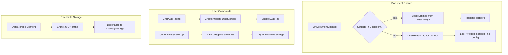

# Document-Based AutoTag Settings with Extensible Storage

## Architecture Overview



## Versioning Strategy: JSON-in-Schema

Store settings as a **serialized JSON string** inside a minimal Extensible
Storage schema. This approach:

- **Minimal verbosity**: One field, one GUID, never changes
- **Reuses existing infrastructure**: Your `JsonTypeMigrations` and schema
  sanitization handle evolution
- **Immutable ES schema**: The ES schema stays stable forever; all versioning
  happens in JSON layer

```csharp
// Schema has exactly ONE field - the serialized JSON
SchemaBuilder builder = new(SchemaGuid);
builder.SetSchemaName("AutoTagSettings");
builder.SetVendorId("PE");
builder.AddSimpleField("JsonData", typeof(string));
```

When `AutoTagSettings` evolves (new properties, type changes), your existing
`ComposableJson` migration logic handles it at the JSON level - the ES schema
never needs to change.

## Implementation

### 1. Create DocumentSettingsStorage Service

**New file**: `source/Pe.Global/Services/Storage/DocumentSettingsStorage.cs`

A generic service for storing any settings type in a Revit document via
DataStorage + Extensible Storage.

```csharp
public class DocumentSettingsStorage<T> where T : class, new() {
    private static readonly Guid SchemaGuid = new("...");  // Unique per T
    
    public T? Read(Document doc);           // Returns null if not found
    public void Write(Document doc, T settings);
    public bool Exists(Document doc);
    public void Delete(Document doc);
}
```

Key implementation details:

- Find existing DataStorage by name convention (`PE_Settings_{TypeName}`)
- Create if not exists on Write
- Use `Element.GetEntity()` / `Element.SetEntity()` for data access
- Serialize T to JSON string using existing `JsonConvert` settings

### 2. Modify AutoTagService

**File**: `source/Pe.Global/Services/AutoTag/AutoTagService.cs`

Changes:

- Remove file-based `_storage` field
- Add `DocumentSettingsStorage<AutoTagSettings>` dependency
- Add per-document settings tracking: `Dictionary<ElementId, AutoTagSettings?>`
- Modify `OnDocumentOpened` to load from document or disable

```csharp
private void OnDocumentOpened(object? sender, DocumentOpenedEventArgs e) {
    var doc = e.Document;
    var settings = _docStorage.Read(doc);
    
    if (settings?.Enabled != true) {
        Log.Information("AutoTag: Disabled for '{Title}' - no document settings", doc.Title);
        return;
    }
    
    // Store for this document and register triggers
    _documentSettings[doc.GetHashCode()] = settings;
    RegisterTriggers(doc, settings);
}
```

### 3. Create CmdAutoTagInit Command

**New file**: `source/Pe.App/Commands/AutoTag/CmdAutoTagInit.cs`

Opens a dialog to configure AutoTag settings and saves them to the document.

```csharp
public class CmdAutoTagInit : IExternalCommand {
    public Result Execute(...) {
        // 1. Load existing settings from doc (or create default)
        // 2. Show configuration UI
        // 3. Save to document via DocumentSettingsStorage
        // 4. Reload AutoTagService for this document
    }
}
```

### 4. Create CmdAutoTagCatchUp Command

**New file**: `source/Pe.App/Commands/AutoTag/CmdAutoTagCatchUp.cs`

Tags all untagged elements that match the current configurations.

```csharp
public class CmdAutoTagCatchUp : IExternalCommand {
    public Result Execute(...) {
        var settings = AutoTagService.Instance.GetSettingsForDocument(doc);
        if (settings == null) return Result.Failed;  // Not configured
        
        using var tx = new Transaction(doc, "AutoTag Catch-Up");
        tx.Start();
        
        foreach (var config in settings.Configurations.Where(c => c.Enabled)) {
            var category = CategoryTagMapping.GetBuiltInCategoryFromName(doc, config.CategoryName);
            var untagged = FindUntaggedElements(doc, category, config);
            foreach (var elem in untagged) {
                TagElement(doc, elem, config);
            }
        }
        
        tx.Commit();
        Log.Information("AutoTag: Tagged {Count} elements", taggedCount);
    }
}
```

### 5. Optional: DocumentChanged Notification

If easy, subscribe to `DocumentChanged` event to detect external settings
changes:

```csharp
app.ControlledApplication.DocumentChanged += (s, e) => {
    var dataStorageChanges = e.GetModifiedElementIds()
        .Select(id => doc.GetElement(id))
        .OfType<DataStorage>()
        .Where(ds => ds.Name.StartsWith("PE_Settings_"));
    
    if (dataStorageChanges.Any()) {
        // Show toast: "AutoTag settings changed. Reload to apply."
    }
};
```

This is low-effort since you're just watching for changes, not syncing.

## File Changes Summary

| File                                                           | Change                                           |
| -------------------------------------------------------------- | ------------------------------------------------ |
| `source/Pe.Global/Services/Storage/DocumentSettingsStorage.cs` | **NEW** - Generic ES-based document storage      |
| `source/Pe.Global/Services/AutoTag/AutoTagService.cs`          | Modify to use document storage, per-doc tracking |
| `source/Pe.App/Commands/AutoTag/CmdAutoTagInit.cs`             | **NEW** - Initialize/configure settings command  |
| `source/Pe.App/Commands/AutoTag/CmdAutoTagCatchUp.cs`          | **NEW** - Tag all untagged elements command      |
| `source/Pe.App/App.cs`                                         | Register new commands in ribbon                  |

## Schema Design

```csharp
// Single, stable schema - never needs to change
public static class AutoTagSchema {
    public static readonly Guid Guid = new("a1b2c3d4-...");  // Generate once, never change
    
    public static Schema GetOrCreate() {
        var schema = Schema.Lookup(Guid);
        if (schema != null) return schema;
        
        var builder = new SchemaBuilder(Guid);
        builder.SetSchemaName("PeAutoTagSettings");
        builder.SetVendorId("PE");
        builder.SetReadAccessLevel(AccessLevel.Public);  // All can read
        builder.SetWriteAccessLevel(AccessLevel.Application);  // Only your addin writes
        builder.SetApplicationGUID(YourAddinGuid);
        builder.AddSimpleField("Version", typeof(int));  // For future migration hints
        builder.AddSimpleField("JsonData", typeof(string));  // The actual settings
        return builder.Finish();
    }
}
```

The `Version` field is optional metadata - your JSON migrations handle the real
work, but this gives you a quick check without deserializing.
