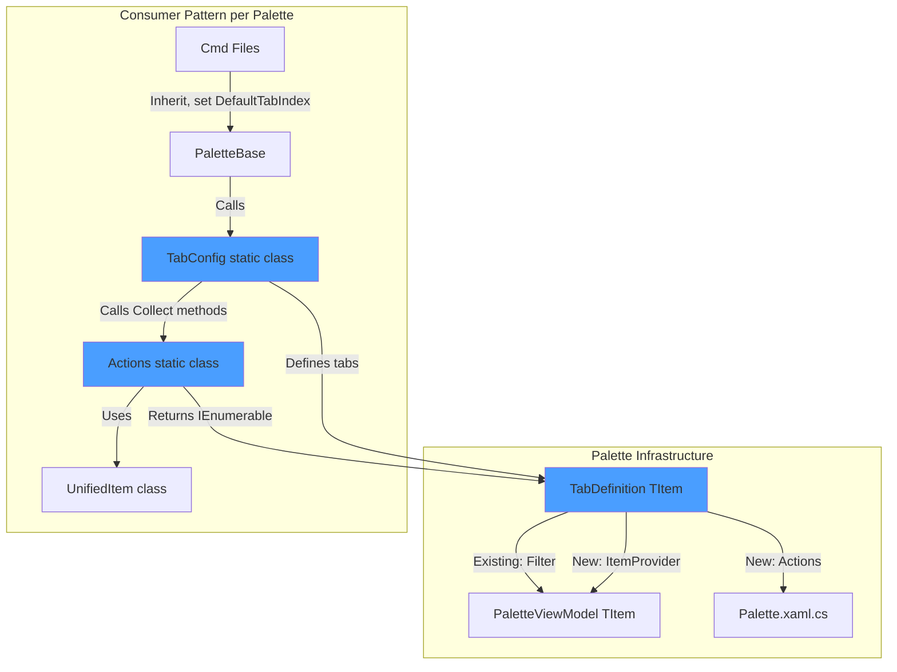

# Per-Tab Actions & Lazy Item Loading Refactor

## Problems We're Solving

### Problem 1: Action Clutter with CanExecute Predicates

Currently, all actions are defined at the palette level and use `CanExecute`
predicates to filter by item type:

```csharp
new() {
    Name = "Place",
    Execute = async item => { /* place logic */ },
    CanExecute = item => item?.ItemType == FamilyItemType.FamilyType && CanPlaceInView()
}
```

This creates cognitive overhead - users see grayed-out actions that never apply\
to the current tab.

### Problem 2: Slow Palette Startup

Currently, all items are collected upfront before showing the palette:

```csharp
// In CmdPltFamilyElements.cs line 46:
var items = CollectFamilyElements(doc, familyDoc).ToList();
```

For complex families with hundreds of dimensions/ref planes, this causes 2-5
second delays. Users must wait for ALL items to be collected even if they only
need the "Params" tab.

### Solution: Tab-Centric Architecture

Make `TabDefinition` the arbiter of all variation:

- **Per-tab actions**: Each tab declares only relevant actions
- **Lazy item loading**: Each tab provides its own collection function, called
  only when activated
- **Per-tab caching**: Items cached per tab after first load

---

## Architecture Overview



---

## Implementation Plan

### Phase 1: Core Infrastructure Changes

#### 1.1 Update `TabDefinition<TItem>` ([source/Pe.Ui/Core/PaletteFactory.cs](source/Pe.Ui/Core/PaletteFactory.cs))

Add new properties for lazy loading and per-tab actions:

```csharp
public class TabDefinition<TItem> where TItem : class, IPaletteListItem {
    public required string Name { get; init; }
    
    // NEW: Lazy item provider (takes precedence over Filter if provided)
    public Func<IEnumerable<TItem>>? ItemProvider { get; init; }
    
    // EXISTING: Filter for shared item collections
    public Func<TItem, bool>? Filter { get; init; }
    
    public Func<TItem, string>? FilterKeySelector { get; init; }
    
    // NEW: Per-tab actions
    public List<PaletteAction<TItem>>? Actions { get; init; }
}
```

#### 1.2 Update `PaletteViewModel<TItem>` ([source/Pe.Ui/ViewModels/PaletteViewModel.cs](source/Pe.Ui/ViewModels/PaletteViewModel.cs))

Add lazy loading support with per-tab caching:

**New fields:**

```csharp
private readonly Dictionary<int, List<TItem>> _tabItemsCache = new();
private readonly bool _usesLazyLoading;
```

**Constructor changes:**

- Accept nullable `items` parameter
- Set `_usesLazyLoading = true` if items is null and tabs have ItemProviders

**New method `GetItemsForCurrentTab()`:**

```csharp
private List<TItem> GetItemsForCurrentTab() {
    // Check cache first
    if (_tabItemsCache.TryGetValue(_selectedTabIndex, out var cached))
        return cached;
    
    var tab = Tabs?[_selectedTabIndex];
    
    // Use ItemProvider if available (lazy loading)
    if (tab?.ItemProvider != null) {
        var items = tab.ItemProvider().ToList();
        _tabItemsCache[_selectedTabIndex] = items;
        
        // Build search cache for this tab only
        _searchService.BuildSearchCache(items);
        
        return items;
    }
    
    // Fallback: use shared items with filter
    return _allItems.Where(tab?.Filter ?? (_ => true)).ToList();
}
```

**Update `FilterItems()` method:**

- Replace `_allItems` with `GetItemsForCurrentTab()`
- Remove Stage 1 tab filtering (now handled by lazy loading)

**Update `SelectedTabIndex` setter:**

- Clear search cache when switching tabs
- Trigger item loading for new tab

#### 1.3 Update `Palette.cs` ([source/Pe.Ui/Components/Palette.xaml.cs](source/Pe.Ui/Components/Palette.xaml.cs))

Add dynamic action switching on tab change:

**New field:**

```csharp
private Dictionary<int, List<PaletteAction<TItem>>> _tabActions = new();
```

**In `Initialize<TItem>()` method:**

- Store per-tab actions in `_tabActions` dictionary
- Fall back to global actions if tab doesn't define any

**Update `InitializeTabs()` method:**

- Wire up tab change to swap actions in ActionBinding

**New method `UpdateActionsForTab()`:**

```csharp
private void UpdateActionsForTab(int tabIndex) {
    if (!_tabActions.TryGetValue(tabIndex, out var actions))
        return; // Use default actions
    
    // Update the action binding with tab-specific actions
    _actionBinding.ClearActions();
    _actionBinding.RegisterRange(actions);
}
```

#### 1.4 Update `PaletteFactory.Create()` ([source/Pe.Ui/Core/PaletteFactory.cs](source/Pe.Ui/Core/PaletteFactory.cs))

**Make `items` parameter nullable:**

```csharp
public static EphemeralWindow Create<TItem>(
    string title,
    IEnumerable<TItem>? items,  // Now nullable
    List<PaletteAction<TItem>>? actions,
    PaletteOptions<TItem> options
)
```

**Update validation:**

- If `items == null`, require that all tabs have `ItemProvider` set
- If `items != null`, tabs can use either `Filter` or `ItemProvider`

---

### Phase 2: Establish File Organization Pattern

For each palette type, create 4 files following this pattern:

```
Palette/
├── PaletteBase.cs          # Abstract base with Execute() and ShowPalette()
├── TabConfig.cs            # Static class defining tabs, referencing Actions
├── Actions.cs              # Static class with Handle* and Collect* methods
└── UnifiedItem.cs          # Item wrapper implementing IPaletteListItem
```

---

### Phase 3: Refactor Family Palette

#### 3.1 Keep Existing Files

- [source/Pe.App/Commands/Palette/FamilyPalette/FamilyPaletteBase.cs](source/Pe.App/Commands/Palette/FamilyPalette/FamilyPaletteBase.cs) -
  Update to use TabConfig
- [source/Pe.App/Commands/Palette/FamilyPalette/UnifiedFamilyItem.cs](source/Pe.App/Commands/Palette/FamilyPalette/UnifiedFamilyItem.cs) -
  No changes needed
- [source/Pe.App/Commands/Palette/CmdPltFamilies.cs](source/Pe.App/Commands/Palette/CmdPltFamilies.cs) -
  No changes needed

#### 3.2 Create New Files

**File: `source/Pe.App/Commands/Palette/FamilyPalette/FamilyTabConfig.cs`**

Static class defining all tab configurations:

```csharp
internal static class FamilyTabConfig {
    internal static List<TabDefinition<UnifiedFamilyItem>> CreateTabs(
        Document doc,
        UIApplication uiapp,
        UIDocument uidoc
    ) {
        return [
            new TabDefinition<UnifiedFamilyItem> {
                Name = "Families",
                ItemProvider = () => FamilyActions.CollectFamilies(doc),
                FilterKeySelector = i => i.TextPill,
                Actions = [
                    new() {
                        Name = "Family Types",
                        Execute = async item => FamilyPaletteBase.ShowPalette(uiapp, defaultTabIndex: 1, filterValue: item?.Family?.Name)
                    },
                    new() {
                        Name = "Open/Edit",
                        Modifiers = ModifierKeys.Control,
                        Execute = async item => FamilyActions.HandleOpenEditFamily(uiapp, item)
                    },
                    new() {
                        Name = "Snoop",
                        Modifiers = ModifierKeys.Alt,
                        Execute = async item => FamilyActions.HandleSnoop(uiapp, doc, item)
                    }
                ]
            },
            new TabDefinition<UnifiedFamilyItem> {
                Name = "Family Types",
                ItemProvider = () => FamilyActions.CollectFamilyTypes(doc),
                FilterKeySelector = i => i.TextPill,
                Actions = [
                    new() {
                        Name = "Place",
                        Execute = async item => FamilyActions.HandlePlace(doc, uidoc, item),
                        CanExecute = item => FamilyActions.CanPlaceInView(uidoc.ActiveView)
                    },
                    new() {
                        Name = "Open/Edit",
                        Modifiers = ModifierKeys.Control,
                        Execute = async item => FamilyActions.HandleOpenEditFamilyType(uiapp, item)
                    },
                    new() {
                        Name = "Inspect Instances",
                        Execute = async item => FamilyPaletteBase.ShowPalette(uiapp, defaultTabIndex: 2, filterValue: item?.FamilySymbol?.Name)
                    },
                    new() {
                        Name = "Snoop",
                        Modifiers = ModifierKeys.Alt,
                        Execute = async item => FamilyActions.HandleSnoop(uiapp, doc, item)
                    }
                ]
            },
            new TabDefinition<UnifiedFamilyItem> {
                Name = "Family Instances",
                ItemProvider = () => FamilyActions.CollectFamilyInstances(doc),
                FilterKeySelector = i => i.TextPill,
                Actions = [
                    new() {
                        Name = "Snoop",
                        Modifiers = ModifierKeys.Alt,
                        Execute = async item => FamilyActions.HandleSnoop(uiapp, doc, item)
                    }
                ]
            }
        ];
    }
}
```

**File: `source/Pe.App/Commands/Palette/FamilyPalette/FamilyActions.cs`**

Static class containing all collection and action handler methods:

```csharp
internal static class FamilyActions {
    // Collection methods (lazy loaded per tab)
    internal static IEnumerable<UnifiedFamilyItem> CollectFamilies(Document doc) {
        foreach (var family in new FilteredElementCollector(doc)
                     .OfClass(typeof(Family))
                     .Cast<Family>()
                     .Where(f => !string.IsNullOrWhiteSpace(f.Name))
                     .OrderBy(f => f.Name))
            yield return new UnifiedFamilyItem(family, doc);
    }
    
    internal static IEnumerable<UnifiedFamilyItem> CollectFamilyTypes(Document doc) {
        foreach (var symbol in new FilteredElementCollector(doc)
                     .OfClass(typeof(FamilySymbol))
                     .Cast<FamilySymbol>()
                     .OrderBy(s => s.Family.Name)
                     .ThenBy(s => s.Name))
            yield return new UnifiedFamilyItem(symbol, doc);
    }
    
    internal static IEnumerable<UnifiedFamilyItem> CollectFamilyInstances(Document doc) {
        foreach (var instance in new FilteredElementCollector(doc)
                     .OfClass(typeof(FamilyInstance))
                     .Cast<FamilyInstance>()
                     .OrderBy(i => i.Symbol.Name)
                     .ThenBy(i => i.Id.Value()))
            yield return new UnifiedFamilyItem(instance, doc);
    }
    
    // Action handlers
    internal static void HandlePlace(Document doc, UIDocument uidoc, UnifiedFamilyItem? item) {
        if (item?.FamilySymbol == null) return;
        try {
            var trans = new Transaction(doc, $"Place {item.FamilySymbol.Family.Name}");
            trans.Start();
            if (!item.FamilySymbol.IsActive) item.FamilySymbol.Activate();
            trans.Commit();
            uidoc.PromptForFamilyInstancePlacement(item.FamilySymbol);
        } catch (Autodesk.Revit.Exceptions.OperationCanceledException) { }
    }
    
    internal static void HandleOpenEditFamily(UIApplication uiapp, UnifiedFamilyItem? item) {
        if (item?.Family != null)
            uiapp.OpenAndActivateFamily(item.Family);
    }
    
    internal static void HandleOpenEditFamilyType(UIApplication uiapp, UnifiedFamilyItem? item) {
        if (item?.FamilySymbol != null)
            OpenAndActivateFamilyType(uiapp, item.FamilySymbol);
    }
    
    internal static void HandleSnoop(UIApplication uiapp, Document doc, UnifiedFamilyItem? item) {
        if (item == null) return;
        object objectToSnoop = item.ItemType switch {
            FamilyItemType.Family => item.Family!,
            FamilyItemType.FamilyType => item.FamilySymbol!,
            FamilyItemType.FamilyInstance => item.FamilyInstance!,
            _ => throw new InvalidOperationException()
        };
        var title = item.ItemType switch {
            FamilyItemType.Family => $"Family: {item.Family!.Name}",
            FamilyItemType.FamilyType => $"Type: {item.FamilySymbol!.Family.Name}: {item.FamilySymbol.Name}",
            FamilyItemType.FamilyInstance => $"Instance: {item.FamilyInstance!.Symbol.Name} ({item.FamilyInstance.Id})",
            _ => string.Empty
        };
        RevitDbExplorerService.TrySnoopObject(uiapp, doc, objectToSnoop, title);
    }
    
    internal static bool CanPlaceInView(View activeView) {
        return !activeView.IsTemplate
            && activeView.ViewType != ViewType.Legend
            && activeView.ViewType != ViewType.DrawingSheet
            && activeView.ViewType != ViewType.DraftingView
            && activeView.ViewType != ViewType.SystemBrowser
            && activeView is not ViewSchedule;
    }
    
    private static void OpenAndActivateFamilyType(UIApplication uiapp, FamilySymbol symbol) {
        uiapp.OpenAndActivateFamily(symbol.Family);
        var famDoc = DocumentManager.FindOpenFamilyDocument(symbol.Family);
        if (famDoc?.IsFamilyDocument != true) return;
        var familyManager = famDoc.FamilyManager;
        var targetType = familyManager.Types.Cast<FamilyType>().FirstOrDefault(t => t.Name == symbol.Name);
        if (targetType == null) return;
        using var tx = new Transaction(famDoc, $"Set {symbol.Name} Type");
        tx.Start();
        familyManager.CurrentType = targetType;
        tx.Commit();
    }
}
```

#### 3.3 Update FamilyPaletteBase.cs

Replace the inline tab definitions and actions with a call to `FamilyTabConfig`:

```csharp
internal static Result ShowPalette(UIApplication uiapp, int defaultTabIndex, string? filterValue = null) {
    try {
        var doc = uiapp.ActiveUIDocument.Document;
        var uidoc = uiapp.ActiveUIDocument;
        
        var previewPanel = new FamilyPreviewPanel(doc);
        var tabs = FamilyTabConfig.CreateTabs(doc, uiapp, uidoc);
        
        var window = PaletteFactory.Create("Family Palette", 
            items: null,  // Lazy loading via ItemProvider
            actions: null,  // Per-tab actions
            new PaletteOptions<UnifiedFamilyItem> {
                Persistence = (new Storage(nameof(CmdPltFamilies)), item => item.PersistenceKey),
                SearchConfig = SearchConfig.PrimaryAndSecondary(),
                Tabs = tabs,
                DefaultTabIndex = defaultTabIndex,
                SidebarPanel = previewPanel,
                ViewModelMutator = vm => {
                    if (string.IsNullOrWhiteSpace(filterValue)) return;
                    vm.SelectedFilterValue = filterValue;
                    if (vm.FilteredItems.Count > 0)
                        vm.SelectedIndex = 0;
                }
            });
        window.Show();
        
        return Result.Succeeded;
    } catch (Exception ex) {
        Log.Error(ex, "Family palette failed to open");
        new Ballogger().Add(LogEventLevel.Error, new StackFrame(), ex, true).Show();
        return Result.Failed;
    }
}
```

---

### Phase 4: Refactor View Palette

Following the same pattern as Family Palette:

#### 4.1 Keep Existing Files

- [source/Pe.App/Commands/Palette/ViewPalette/ViewPaletteBase.cs](source/Pe.App/Commands/Palette/ViewPalette/ViewPaletteBase.cs)
- [source/Pe.App/Commands/Palette/ViewPalette/UnifiedViewItem.cs](source/Pe.App/Commands/Palette/ViewPalette/UnifiedViewItem.cs)
- [source/Pe.App/Commands/Palette/CmdPltViews.cs](source/Pe.App/Commands/Palette/CmdPltViews.cs)

#### 4.2 Create New Files

**File: `source/Pe.App/Commands/Palette/ViewPalette/ViewTabConfig.cs`**

```csharp
internal static class ViewTabConfig {
    internal static List<TabDefinition<UnifiedViewItem>> CreateTabs(
        Document doc,
        UIApplication uiapp,
        SheetLookupCache sheetCache
    ) {
        return [
            new TabDefinition<UnifiedViewItem> {
                Name = "All",
                ItemProvider = () => ViewActions.CollectAllViews(doc, sheetCache),
                FilterKeySelector = null,
                Actions = [
                    new() {
                        Name = "Open",
                        Execute = async item => ViewActions.HandleOpen(uiapp, item)
                    },
                    new() {
                        Name = "Snoop",
                        Modifiers = ModifierKeys.Alt,
                        Execute = async item => ViewActions.HandleSnoop(uiapp, doc, item)
                    }
                ]
            },
            new TabDefinition<UnifiedViewItem> {
                Name = "Views",
                ItemProvider = () => ViewActions.CollectViews(doc, sheetCache),
                FilterKeySelector = i => i.TextPill,
                Actions = [/* same as All */]
            },
            new TabDefinition<UnifiedViewItem> {
                Name = "Schedules",
                ItemProvider = () => ViewActions.CollectSchedules(doc, sheetCache),
                FilterKeySelector = i => i.TextPill,
                Actions = [/* same as All */]
            },
            new TabDefinition<UnifiedViewItem> {
                Name = "Sheets",
                ItemProvider = () => ViewActions.CollectSheets(doc, sheetCache),
                FilterKeySelector = i => i.TextPill,
                Actions = [/* same as All */]
            }
        ];
    }
}
```

**File: `source/Pe.App/Commands/Palette/ViewPalette/ViewActions.cs`**

Extract collection and action methods from ViewPaletteBase into static helpers.

#### 4.3 Update ViewPaletteBase.cs

Simplify to use ViewTabConfig.

---

### Phase 5: Refactor Family Elements Palette

This is the palette with the worst performance problems. Apply the full pattern
and add per-tab commands.

#### 5.1 Create New File Structure

**New Files:**

- `source/Pe.App/Commands/Palette/FamilyPalette/FamilyElementsPaletteBase.cs` -
  Abstract base
- `source/Pe.App/Commands/Palette/FamilyPalette/FamilyElementsTabConfig.cs` -
  Tab definitions
- `source/Pe.App/Commands/Palette/FamilyPalette/FamilyElementsActions.cs` -
  Action handlers

**Update Existing:**

- [source/Pe.App/Commands/Palette/CmdPltFamilyElements.cs](source/Pe.App/Commands/Palette/CmdPltFamilyElements.cs) -
  Convert to multi-command pattern

#### 5.2 Create FamilyElementsPaletteBase.cs

```csharp
public abstract class FamilyElementsPaletteBase : IExternalCommand {
    protected abstract int DefaultTabIndex { get; }
    
    public Result Execute(ExternalCommandData commandData, ref string message, ElementSet elementSet) {
        try {
            return ShowPalette(commandData.Application, this.DefaultTabIndex);
        } catch (Exception ex) {
            Log.Error(ex, "Family elements palette command failed");
            new Ballogger().Add(LogEventLevel.Error, new StackFrame(), ex, true).Show();
            return Result.Failed;
        }
    }
    
    internal static Result ShowPalette(UIApplication uiapp, int defaultTabIndex) {
        var uidoc = uiapp.ActiveUIDocument;
        var doc = uidoc.Document;
        
        if (!doc.IsFamilyDocument) {
            TaskDialog.Show("Family Elements", "Family Elements palette is only available in family documents.");
            return Result.Cancelled;
        }
        
        var familyDoc = new FamilyDocument(doc);
        var previewPanel = new FamilyElementPreviewPanel(uidoc);
        var highlighter = new ElementHighlighter(uidoc);
        var tabs = FamilyElementsTabConfig.CreateTabs(doc, uiapp, uidoc, familyDoc);
        
        var window = PaletteFactory.Create("Family Elements",
            items: null,  // Lazy loading
            actions: null,  // Per-tab actions
            new PaletteOptions<FamilyElementItem> {
                SearchConfig = SearchConfig.PrimaryAndSecondary(),
                Tabs = tabs,
                DefaultTabIndex = defaultTabIndex,
                SidebarPanel = previewPanel,
                OnSelectionChanged = item => {
                    if (item?.ElementId != null)
                        highlighter.Highlight(item.ElementId);
                }
            });
        
        window.Closed += (_, _) => highlighter.Dispose();
        window.Show();
        
        return Result.Succeeded;
    }
}
```

#### 5.3 Create FamilyElementsTabConfig.cs

Define 6 tabs (All, Families, Params, Dims, Ref Planes, Connectors), each with:

- Lazy `ItemProvider` calling specific collection method
- Tab-specific actions (e.g., "Zoom to Element" not available for Parameters)

#### 5.4 Create FamilyElementsActions.cs

Extract all collection methods:

- `CollectAllElements()`
- `CollectFamilies()`
- `CollectParameters()`
- `CollectDimensions()`
- `CollectReferencePlanes()`
- `CollectConnectors()`

And action handlers:

- `HandleZoomToElement()`
- `HandleSnoop()`

#### 5.5 Update CmdPltFamilyElements.cs

Convert from single command to multi-command pattern:

```csharp
[Transaction(TransactionMode.Manual)]
public class CmdPltFamilyElements : FamilyElementsPaletteBase {
    protected override int DefaultTabIndex => 0;  // All tab
}

[Transaction(TransactionMode.Manual)]
public class CmdPltFamilyElementsParams : FamilyElementsPaletteBase {
    protected override int DefaultTabIndex => 2;  // Params tab
}

[Transaction(TransactionMode.Manual)]
public class CmdPltFamilyElementsDims : FamilyElementsPaletteBase {
    protected override int DefaultTabIndex => 3;  // Dims tab
}

// ... etc for other tabs
```

---

## Expected Performance Improvements

### Before Refactor

- **Family Elements palette open**: 2-5 seconds (collect all: families, params,
  dims, ref planes, connectors)
- **Switch to Params tab**: instant (already collected)

### After Refactor

- **Palette open**: ~50ms (show UI only, no collection)
- **First switch to Params tab**: ~200ms (collect only parameters)
- **Subsequent switches**: instant (cached)
- **Net improvement**: 10-100x faster perceived startup time

---

## Testing Strategy

1. Test each palette type independently
2. Verify lazy loading works correctly (breakpoint in ItemProvider)
3. Verify tab caching (second tab switch should not call ItemProvider)
4. Verify per-tab actions show/hide correctly
5. Verify search works correctly with lazy-loaded items
6. Test with both simple documents and complex families
7. Verify backward compatibility with existing filter-based tabs

---

## Migration Notes

- **Backward compatible**: Existing palettes using `Filter` pattern continue to
  work
- **Opt-in**: Palettes use lazy loading only when `items: null` and tabs have
  `ItemProvider`
- **Gradual rollout**: Can migrate palettes one at a time
- **Performance critical first**: Prioritize CmdPltFamilyElements (biggest perf\
  gain)
