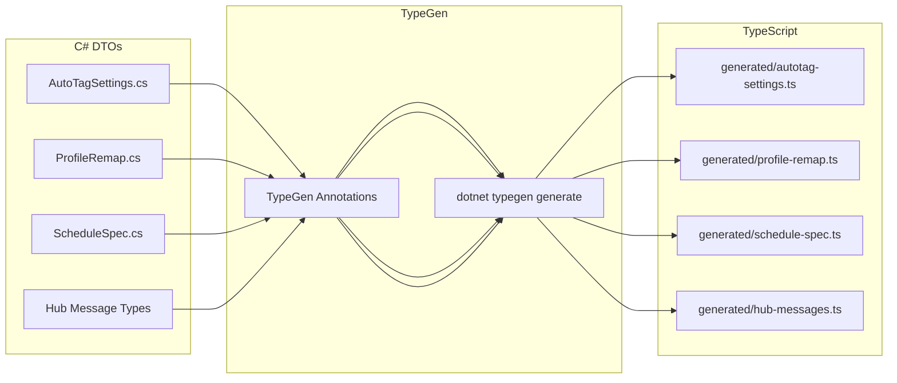
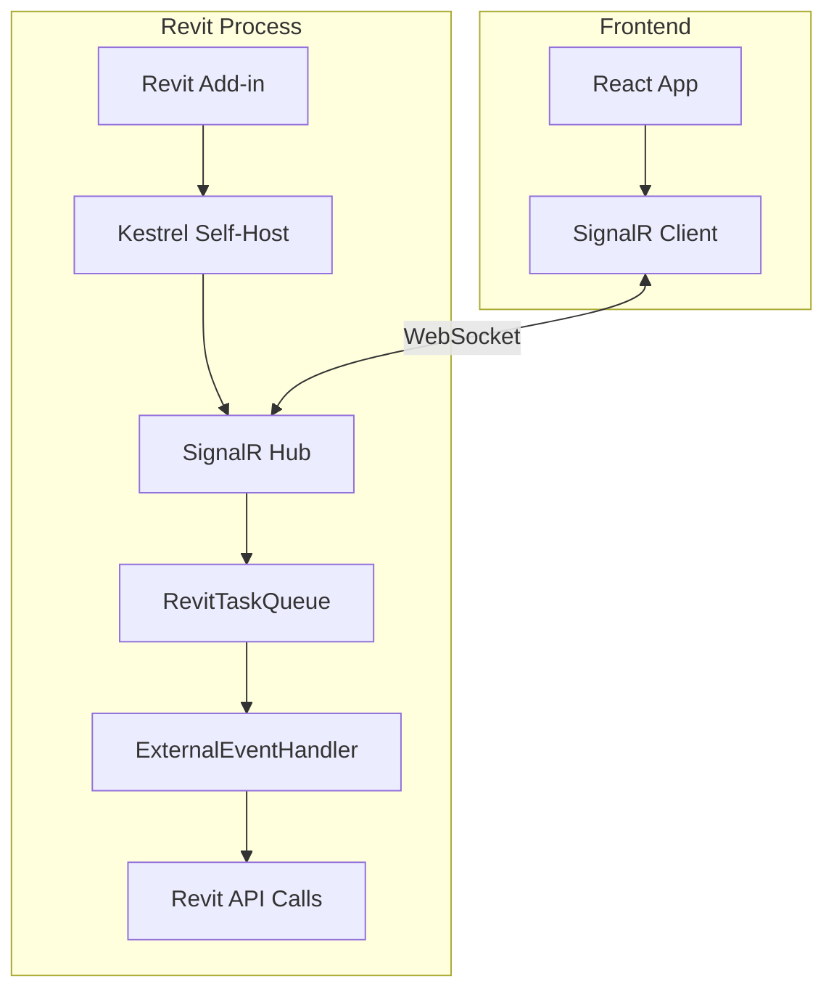

# SignalR Settings Editor Backend

## Architectural Context

### Settings Patterns in the Codebase

Three distinct patterns exist for settings consumption:


| Pattern             | Example              | Storage            | Runtime Source         | "Run Without Saving"                           |
| ------------------- | -------------------- | ------------------ | ---------------------- | ---------------------------------------------- |
| Document-Embedded   | `CmdAutoTag`         | Extensible Storage | Document ES            | Execute with in-memory settings, don't persist |
| Filesystem Profiles | `CmdFFMigrator`      | JSON files         | `.Read()` at execution | Pass deserialized object directly              |
| Filesystem Specs    | `CmdSchedulePalette` | JSON files         | `.Read()` at execution | Pass deserialized object directly              |


The backend must support all three patterns uniformly.

### Cross-Language Type Safety Strategy




**TypeGen** generates TypeScript interfaces from C# classes with `[ExportTs*]`
attributes. This ensures:

- Hub message payloads match exactly
- Settings DTOs are shared
- Enum values align

---

## 1. TypeGen Setup

### Install and Configure

```xml
<!-- Add to Build.csproj or create a dedicated codegen project -->
<PackageReference Include="TypeGen.Core" Version="4.*" />
<PackageReference Include="TypeGen.Cli" Version="4.*" />
```

Create `typegen.json` in solution root:

```json
{
    "assemblies": [
        "source/Pe.Global/bin/Debug/net8.0-windows/Pe.Global.dll"
    ],
    "outputPath": "../settings-editor-frontend/src/generated",
    "createIndexFile": true,
    "enumStringInitializers": true
}
```

### Annotate DTOs

```csharp
// AutoTagSettings.cs
using TypeGen.Core.TypeAnnotations;

[ExportTsInterface]
public class AutoTagSettings {
    public bool Enabled { get; set; } = true;
    public List<AutoTagConfiguration> Configurations { get; set; } = [];
}

[ExportTsInterface]
public class AutoTagConfiguration {
    public string CategoryName { get; set; } = string.Empty;
    public string TagFamilyName { get; set; } = string.Empty;
    public string TagTypeName { get; set; } = "Standard";
    // ... other properties
}

[ExportTsEnum]
public enum TagOrientationMode {
    Horizontal,
    Vertical
}
```

### Generate Types

```bash
# Add to build script or CI
dotnet typegen generate
```

Generated output:

```typescript
// generated/auto-tag-settings.ts
export interface AutoTagSettings {
    enabled: boolean;
    configurations: AutoTagConfiguration[];
}

export interface AutoTagConfiguration {
    categoryName: string;
    tagFamilyName: string;
    tagTypeName: string;
    // ...
}

export type TagOrientationMode = "Horizontal" | "Vertical";
```

---

## 2. SignalR Self-Hosted Server

### Architecture

The SignalR server runs as a self-hosted Kestrel instance within the Revit
add-in process. This avoids IPC complexity and keeps everything in-process.




### Implementation

**New file**: `source/Pe.Global/Services/SignalR/SettingsEditorServer.cs`

```csharp
using Microsoft.AspNetCore.Builder;
using Microsoft.AspNetCore.Hosting;
using Microsoft.AspNetCore.SignalR;
using Microsoft.Extensions.DependencyInjection;

public class SettingsEditorServer : IDisposable {
    private WebApplication? _app;
    private readonly int _port;
    
    public SettingsEditorServer(int port = 5150) {
        _port = port;
    }
    
    public async Task StartAsync(UIApplication uiApp) {
        var builder = WebApplication.CreateBuilder();
        
        builder.Services.AddSignalR()
            .AddNewtonsoftJsonProtocol();  // Match existing JSON settings
        
        builder.Services.AddCors(options => {
            options.AddDefaultPolicy(policy => {
                policy.WithOrigins("http://localhost:5173")  // Vite dev server
                      .AllowAnyHeader()
                      .AllowAnyMethod()
                      .AllowCredentials();
            });
        });
        
        // Register Revit context and task queue
        builder.Services.AddSingleton(new RevitContext(uiApp));
        builder.Services.AddSingleton<RevitTaskQueue>();
        
        builder.WebHost.UseUrls($"http://localhost:{_port}");
        
        _app = builder.Build();
        _app.UseCors();
        
        _app.MapHub<SchemaHub>("/hubs/schema");
        _app.MapHub<SettingsHub>("/hubs/settings");
        _app.MapHub<ActionsHub>("/hubs/actions");
        
        await _app.StartAsync();
    }
    
    public void Dispose() => _app?.DisposeAsync().AsTask().Wait();
}
```

### Lifecycle Management

Start the server in `App.cs`:

```csharp
public class App : IExternalApplication {
    private SettingsEditorServer? _server;
    
    public Result OnStartup(UIControlledApplication application) {
        // ... existing startup code ...
        
        // Start SignalR server on first document open
        application.ControlledApplication.DocumentOpened += OnFirstDocumentOpened;
        return Result.Succeeded;
    }
    
    private void OnFirstDocumentOpened(object? sender, DocumentOpenedEventArgs e) {
        if (_server != null) return;
        
        _server = new SettingsEditorServer();
        _ = _server.StartAsync(new UIApplication(sender as Application));
        
        // Unsubscribe after first start
        (sender as Application)!.DocumentOpened -= OnFirstDocumentOpened;
    }
}
```

---

## 3. Revit Thread Marshaling

All Revit API calls must execute on Revit's main thread. Use ExternalEvent for
this.

**New file**: `source/Pe.Global/Services/SignalR/RevitTaskQueue.cs`

```csharp
public class RevitTaskQueue {
    private readonly ExternalEvent _externalEvent;
    private readonly ConcurrentQueue<Func<UIApplication, Task>> _tasks = new();
    private TaskCompletionSource<object?>? _currentTcs;
    
    public RevitTaskQueue(RevitContext context) {
        _externalEvent = ExternalEvent.Create(new TaskQueueHandler(this, context));
    }
    
    public async Task<T> EnqueueAsync<T>(Func<UIApplication, T> action) {
        var tcs = new TaskCompletionSource<object?>();
        _tasks.Enqueue(uiApp => {
            try {
                var result = action(uiApp);
                tcs.SetResult(result);
            } catch (Exception ex) {
                tcs.SetException(ex);
            }
            return Task.CompletedTask;
        });
        
        _currentTcs = tcs;
        _externalEvent.Raise();
        
        return (T)(await tcs.Task)!;
    }
    
    internal void ProcessQueue(UIApplication uiApp) {
        while (_tasks.TryDequeue(out var task)) {
            task(uiApp).Wait();
        }
    }
}

internal class TaskQueueHandler : IExternalEventHandler {
    private readonly RevitTaskQueue _queue;
    private readonly RevitContext _context;
    
    public TaskQueueHandler(RevitTaskQueue queue, RevitContext context) {
        _queue = queue;
        _context = context;
    }
    
    public void Execute(UIApplication app) {
        _queue.ProcessQueue(app);
    }
    
    public string GetName() => "SettingsEditorTaskQueue";
}
```

---

## 4. SchemaHub Implementation

**New file**: `source/Pe.Global/Services/SignalR/Hubs/SchemaHub.cs`

```csharp
using TypeGen.Core.TypeAnnotations;

[ExportTsInterface]
public record SchemaRequest(string SettingsTypeName, bool IsExtends = false);

[ExportTsInterface]
public record SchemaResponse(string SchemaJson, string? FragmentSchemaJson);

[ExportTsInterface]
public record ExamplesRequest(string SettingsTypeName, string PropertyPath, Dictionary<string, string>? SiblingValues);

[ExportTsInterface]
public record ExamplesResponse(List<string> Examples);

public class SchemaHub : Hub {
    private readonly RevitTaskQueue _taskQueue;
    
    public SchemaHub(RevitTaskQueue taskQueue) {
        _taskQueue = taskQueue;
    }
    
    /// <summary>
    /// Get JSON schema for a settings type.
    /// </summary>
    public async Task<SchemaResponse> GetSchema(SchemaRequest request) {
        return await _taskQueue.EnqueueAsync(uiApp => {
            var type = ResolveSettingsType(request.SettingsTypeName);
            
            var (full, extends) = JsonSchemaFactory.CreateSchemas(type, out var examplesProcessor);
            examplesProcessor.Finalize(request.IsExtends ? extends : full);
            
            var fragmentSchema = TryGetFragmentSchema(type);
            
            return new SchemaResponse(
                request.IsExtends ? extends.ToJson() : full.ToJson(),
                fragmentSchema?.ToJson()
            );
        });
    }
    
    /// <summary>
    /// Get dynamic examples for a property, with optional filtering based on sibling values.
    /// This is the key to dependent field filtering.
    /// </summary>
    public async Task<ExamplesResponse> GetExamples(ExamplesRequest request) {
        return await _taskQueue.EnqueueAsync(uiApp => {
            var type = ResolveSettingsType(request.SettingsTypeName);
            var property = ResolveProperty(type, request.PropertyPath);
            
            var providerAttr = property.GetCustomAttribute<SchemaExamplesAttribute>();
            if (providerAttr == null) 
                return new ExamplesResponse([]);
            
            var provider = Activator.CreateInstance(providerAttr.ProviderType) as IOptionsProvider;
            if (provider == null)
                return new ExamplesResponse([]);
            
            // Handle dependent filtering
            if (provider is IDependentOptionsProvider dependentProvider && request.SiblingValues != null) {
                return new ExamplesResponse(
                    dependentProvider.GetExamples(request.SiblingValues).ToList()
                );
            }
            
            return new ExamplesResponse(provider.GetExamples().ToList());
        });
    }
    
    private static Type ResolveSettingsType(string typeName) {
        // Map friendly names to types
        return typeName switch {
            "AutoTagSettings" => typeof(AutoTagSettings),
            "ProfileRemap" => typeof(ProfileRemap),
            "ScheduleSpec" => typeof(ScheduleSpec),
            _ => throw new ArgumentException($"Unknown settings type: {typeName}")
        };
    }
}
```

---

## 5. Dependent Field Provider Pattern

For filtering `TagTypeName` by `TagFamilyName`, create a new provider interface:

**New file**:
`source/Pe.Global/Services/Storage/Core/Json/SchemaProviders/IDependentOptionsProvider.cs`

```csharp
/// <summary>
/// Options provider that can filter results based on sibling property values.
/// </summary>
public interface IDependentOptionsProvider : IOptionsProvider {
    /// <summary>
    /// Keys that this provider depends on (property paths relative to parent object).
    /// </summary>
    IReadOnlyList<string> DependsOn { get; }
    
    /// <summary>
    /// Get filtered examples based on sibling values.
    /// </summary>
    /// <param name="siblingValues">Map of property path to current value</param>
    IEnumerable<string> GetExamples(IReadOnlyDictionary<string, string> siblingValues);
}
```

**Update**:
`source/Pe.Global/Services/Storage/Core/Json/SchemaProviders/TagProviders.cs`

```csharp
public class AnnotationTagTypeNamesProvider : IDependentOptionsProvider {
    public IReadOnlyList<string> DependsOn => ["TagFamilyName"];
    
    public IEnumerable<string> GetExamples() {
        // Return all tag type names (unfiltered)
        var doc = RevitContext.Current?.Document;
        if (doc == null) return [];
        
        return new FilteredElementCollector(doc)
            .OfClass(typeof(FamilySymbol))
            .Cast<FamilySymbol>()
            .Where(fs => IsTagCategory(fs))
            .Select(fs => fs.Name)
            .Distinct()
            .OrderBy(n => n);
    }
    
    public IEnumerable<string> GetExamples(IReadOnlyDictionary<string, string> siblingValues) {
        var doc = RevitContext.Current?.Document;
        if (doc == null) return [];
        
        // Filter by family name if provided
        if (!siblingValues.TryGetValue("TagFamilyName", out var familyName) || string.IsNullOrEmpty(familyName))
            return GetExamples();  // Fall back to unfiltered
        
        return new FilteredElementCollector(doc)
            .OfClass(typeof(FamilySymbol))
            .Cast<FamilySymbol>()
            .Where(fs => IsTagCategory(fs) && fs.FamilyName == familyName)
            .Select(fs => fs.Name)
            .Distinct()
            .OrderBy(n => n);
    }
}
```

**Schema extension for frontend awareness**:

Add custom `x-depends-on` to schema during generation:

```csharp
// In SchemaExamplesProcessor
if (provider is IDependentOptionsProvider dependentProvider) {
    schema.ExtensionData ??= new Dictionary<string, object?>();
    schema.ExtensionData["x-depends-on"] = dependentProvider.DependsOn;
    schema.ExtensionData["x-provider"] = providerType.Name;
}
```

---

## 6. SettingsHub Implementation

**New file**: `source/Pe.Global/Services/SignalR/Hubs/SettingsHub.cs`

```csharp
[ExportTsInterface]
public record SettingsFile(string Path, string Name, DateTimeOffset Modified, bool IsFragment);

[ExportTsInterface]
public record ListSettingsRequest(string SettingsTypeName, string? SubDirectory);

[ExportTsInterface]
public record ReadSettingsRequest(string SettingsTypeName, string FileName, bool ResolveComposition);

[ExportTsInterface]
public record ReadSettingsResponse(string Json, string ResolvedJson, List<string> ValidationErrors);

[ExportTsInterface]
public record WriteSettingsRequest(string SettingsTypeName, string FileName, string Json, bool Validate);

[ExportTsInterface]
public record WriteSettingsResponse(bool Success, List<string> ValidationErrors);

public class SettingsHub : Hub {
    private readonly RevitTaskQueue _taskQueue;
    
    public SettingsHub(RevitTaskQueue taskQueue) {
        _taskQueue = taskQueue;
    }
    
    /// <summary>
    /// List available settings files for a type.
    /// </summary>
    public async Task<List<SettingsFile>> ListSettings(ListSettingsRequest request) {
        var storage = new Storage(GetStorageName(request.SettingsTypeName));
        var dir = storage.SettingsDir();
        
        if (!string.IsNullOrEmpty(request.SubDirectory))
            dir = dir.SubDir(request.SubDirectory, false);
        
        return dir.ListJsonFiles()
            .Select(f => new SettingsFile(
                f.FullName,
                Path.GetFileNameWithoutExtension(f.Name),
                f.LastWriteTimeUtc,
                f.Name.Contains("-fragment")
            ))
            .ToList();
    }
    
    /// <summary>
    /// Read a settings file, optionally resolving $extends and $include.
    /// </summary>
    public async Task<ReadSettingsResponse> ReadSettings(ReadSettingsRequest request) {
        return await _taskQueue.EnqueueAsync(uiApp => {
            var storage = new Storage(GetStorageName(request.SettingsTypeName));
            var type = ResolveSettingsType(request.SettingsTypeName);
            
            var composable = CreateComposableJson(type, storage, request.FileName);
            
            var rawJson = File.ReadAllText(composable.FilePath);
            var resolvedJson = rawJson;
            var errors = new List<string>();
            
            if (request.ResolveComposition) {
                try {
                    var resolved = composable.ReadRaw();  // Returns resolved JObject
                    resolvedJson = resolved.ToString(Formatting.Indented);
                } catch (JsonValidationException ex) {
                    errors.AddRange(ex.ValidationErrors);
                }
            }
            
            return new ReadSettingsResponse(rawJson, resolvedJson, errors);
        });
    }
    
    /// <summary>
    /// Write settings to a file with optional validation.
    /// </summary>
    public async Task<WriteSettingsResponse> WriteSettings(WriteSettingsRequest request) {
        return await _taskQueue.EnqueueAsync(uiApp => {
            var storage = new Storage(GetStorageName(request.SettingsTypeName));
            var type = ResolveSettingsType(request.SettingsTypeName);
            
            var errors = new List<string>();
            
            if (request.Validate) {
                var schema = JsonSchemaFactory.CreateSchema(type, out var processor);
                processor.Finalize(schema);
                
                var validationErrors = schema.Validate(request.Json);
                errors.AddRange(validationErrors.Select(e => e.ToString()));
                
                if (errors.Count > 0)
                    return new WriteSettingsResponse(false, errors);
            }
            
            var composable = CreateComposableJson(type, storage, request.FileName);
            File.WriteAllText(composable.FilePath, request.Json);
            
            return new WriteSettingsResponse(true, []);
        });
    }
    
    /// <summary>
    /// Resolve $extends and $include without saving.
    /// Used for preview and "run without saving" scenarios.
    /// </summary>
    public async Task<ReadSettingsResponse> ResolveComposition(string settingsTypeName, string json) {
        return await _taskQueue.EnqueueAsync(uiApp => {
            var type = ResolveSettingsType(settingsTypeName);
            var errors = new List<string>();
            
            try {
                // Parse and resolve in-memory
                var jObject = JObject.Parse(json);
                // ... apply $extends and $include resolution logic ...
                
                return new ReadSettingsResponse(json, jObject.ToString(), []);
            } catch (Exception ex) {
                errors.Add(ex.Message);
                return new ReadSettingsResponse(json, json, errors);
            }
        });
    }
}
```

---

## 7. ActionsHub Implementation

**New file**: `source/Pe.Global/Services/SignalR/Hubs/ActionsHub.cs`

```csharp
[ExportTsInterface]
public record ExecuteActionRequest(
    string ActionName,
    string SettingsTypeName,
    string SettingsJson,
    bool PersistSettings  // false = "run without saving"
);

[ExportTsInterface]
public record ExecuteActionResponse(bool Success, string? Error, object? Result);

public class ActionsHub : Hub {
    private readonly RevitTaskQueue _taskQueue;
    private readonly IServiceProvider _services;
    
    public ActionsHub(RevitTaskQueue taskQueue, IServiceProvider services) {
        _taskQueue = taskQueue;
        _services = services;
    }
    
    /// <summary>
    /// Execute a Revit action with the provided settings.
    /// </summary>
    public async Task<ExecuteActionResponse> Execute(ExecuteActionRequest request) {
        return await _taskQueue.EnqueueAsync(uiApp => {
            try {
                var settingsType = ResolveSettingsType(request.SettingsTypeName);
                var settings = JsonConvert.DeserializeObject(request.SettingsJson, settingsType);
                
                // Resolve action handler
                var handler = ResolveActionHandler(request.ActionName, request.SettingsTypeName);
                
                // Execute with appropriate persistence
                object? result;
                if (request.PersistSettings) {
                    // Pattern 1 (AutoTag): Save to document storage first
                    // Pattern 2/3 (FF/Schedule): Save to filesystem first
                    PersistSettings(request.SettingsTypeName, settings, uiApp);
                    result = handler.Execute(uiApp, settings);
                } else {
                    // "Run without saving" - execute with in-memory settings only
                    result = handler.ExecuteWithoutPersist(uiApp, settings);
                }
                
                return new ExecuteActionResponse(true, null, result);
            } catch (Exception ex) {
                return new ExecuteActionResponse(false, ex.Message, null);
            }
        });
    }
    
    /// <summary>
    /// Stream progress updates for long-running operations.
    /// </summary>
    public async IAsyncEnumerable<ProgressUpdate> ExecuteWithProgress(ExecuteActionRequest request) {
        var channel = Channel.CreateUnbounded<ProgressUpdate>();
        
        _ = _taskQueue.EnqueueAsync(uiApp => {
            var handler = ResolveActionHandler(request.ActionName, request.SettingsTypeName);
            handler.ExecuteWithProgress(uiApp, request.SettingsJson, update => {
                channel.Writer.TryWrite(update);
            });
            channel.Writer.Complete();
            return Task.CompletedTask;
        });
        
        await foreach (var update in channel.Reader.ReadAllAsync()) {
            yield return update;
        }
    }
}

[ExportTsInterface]
public record ProgressUpdate(int Percent, string Message, string? CurrentItem);
```

### Action Handler Pattern

Create action handlers for each command:

```csharp
public interface IActionHandler {
    string ActionName { get; }
    string SettingsTypeName { get; }
    
    object? Execute(UIApplication uiApp, object settings);
    object? ExecuteWithoutPersist(UIApplication uiApp, object settings);
}

public class AutoTagCatchUpHandler : IActionHandler {
    public string ActionName => "AutoTag.CatchUp";
    public string SettingsTypeName => "AutoTagSettings";
    
    public object? Execute(UIApplication uiApp, object settings) {
        var autoTagSettings = (AutoTagSettings)settings;
        // Save to document storage
        AutoTagService.Instance.SaveSettingsForDocument(uiApp.ActiveUIDocument.Document, autoTagSettings);
        // Then execute
        return ExecuteCatchUp(uiApp, autoTagSettings);
    }
    
    public object? ExecuteWithoutPersist(UIApplication uiApp, object settings) {
        var autoTagSettings = (AutoTagSettings)settings;
        // Execute directly without saving
        return ExecuteCatchUp(uiApp, autoTagSettings);
    }
    
    private object? ExecuteCatchUp(UIApplication uiApp, AutoTagSettings settings) {
        // ... existing catch-up logic from CmdAutoTag ...
    }
}
```

---

## 8. Document State Notifications

Push updates when document state changes (families loaded, parameters added,
etc.):

```csharp
// In SettingsEditorServer or a dedicated service
public class DocumentStateNotifier {
    private readonly IHubContext<SchemaHub> _schemaHub;
    
    public DocumentStateNotifier(IHubContext<SchemaHub> schemaHub, Application app) {
        _schemaHub = schemaHub;
        
        // Subscribe to relevant events
        app.DocumentChanged += OnDocumentChanged;
        app.DocumentOpened += OnDocumentOpened;
        app.DocumentClosed += OnDocumentClosed;
    }
    
    private void OnDocumentChanged(object? sender, DocumentChangedEventArgs e) {
        // Check if changes affect provider data (families, parameters, etc.)
        var relevantCategories = new[] {
            BuiltInCategory.OST_FamilySymbol,
            BuiltInCategory.OST_SharedParameterDefinitions
        };
        
        var hasRelevantChanges = e.GetModifiedElementIds()
            .Concat(e.GetAddedElementIds())
            .Concat(e.GetDeletedElementIds())
            .Any(id => IsRelevantChange(e.GetDocument(), id, relevantCategories));
        
        if (hasRelevantChanges) {
            // Notify all connected clients to refresh examples
            _ = _schemaHub.Clients.All.SendAsync("ExamplesInvalidated");
        }
    }
}
```

---

## File Summary


| File                                                                                       | Description                                       |
| ------------------------------------------------------------------------------------------ | ------------------------------------------------- |
| `source/Pe.Global/Services/SignalR/SettingsEditorServer.cs`                                | **NEW** - Self-hosted SignalR server              |
| `source/Pe.Global/Services/SignalR/RevitTaskQueue.cs`                                      | **NEW** - Revit thread marshaling                 |
| `source/Pe.Global/Services/SignalR/RevitContext.cs`                                        | **NEW** - Shared Revit application context        |
| `source/Pe.Global/Services/SignalR/Hubs/SchemaHub.cs`                                      | **NEW** - Schema and examples API                 |
| `source/Pe.Global/Services/SignalR/Hubs/SettingsHub.cs`                                    | **NEW** - Settings CRUD API                       |
| `source/Pe.Global/Services/SignalR/Hubs/ActionsHub.cs`                                     | **NEW** - Action execution API                    |
| `source/Pe.Global/Services/SignalR/DocumentStateNotifier.cs`                               | **NEW** - Push notifications                      |
| `source/Pe.Global/Services/Storage/Core/Json/SchemaProviders/IDependentOptionsProvider.cs` | **NEW** - Dependent field interface               |
| `source/Pe.Global/Services/Storage/Core/Json/SchemaProviders/TagProviders.cs`              | **MODIFY** - Implement dependent filtering        |
| `source/Pe.App/App.cs`                                                                     | **MODIFY** - Start SignalR server                 |
| `typegen.json`                                                                             | **NEW** - TypeGen configuration                   |
| Various DTOs                                                                               | **MODIFY** - Add `[ExportTsInterface]` attributes |


---

## NuGet Dependencies

```xml
<PackageReference Include="Microsoft.AspNetCore.SignalR" Version="1.*" />
<PackageReference Include="Microsoft.AspNetCore.SignalR.Protocols.NewtonsoftJson" Version="8.*" />
<PackageReference Include="TypeGen.Core" Version="4.*" />
```

---

## Open Questions

1. **Port management**: Should we use a fixed port (5150) or dynamic allocation?
2. **Authentication**: Do we need any auth for the SignalR connection? (Probably
  not for localhost-only)
3. **Multiple documents**: How to handle multiple open Revit documents? Context
  switching?
4. **Cleanup**: When should the server shut down? On Revit exit only?

