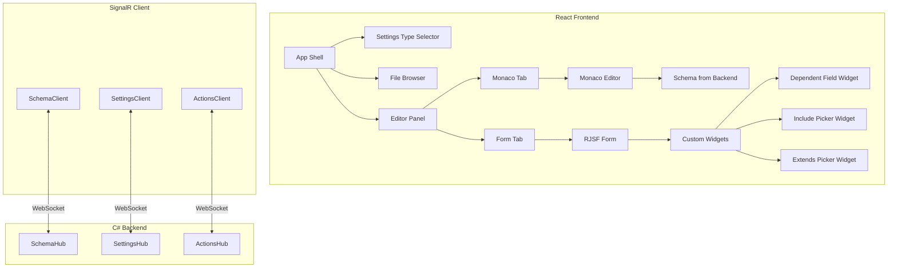

# SignalR Settings Editor Frontend

## Architecture Overview



---

## 1. Project Setup

### Create Vite Project

```bash
npm create vite@latest settings-editor-frontend -- --template react-ts
cd settings-editor-frontend
npm install
```

### Install Dependencies

```bash
# SignalR
npm install @microsoft/signalr

# Monaco Editor
npm install @monaco-editor/react monaco-editor

# Form Generation
npm install @rjsf/core @rjsf/utils @rjsf/validator-ajv8 @rjsf/fluent-ui

# UI Components
npm install @fluentui/react-components @fluentui/react-icons

# State Management
npm install zustand

# Utilities
npm install lodash-es @types/lodash-es
```

### Project Structure

```
src/
├── generated/           # TypeGen output (from C#)
│   ├── auto-tag-settings.ts
│   ├── profile-remap.ts
│   ├── hub-messages.ts
│   └── index.ts
├── api/
│   ├── signalr-client.ts
│   ├── schema-client.ts
│   ├── settings-client.ts
│   └── actions-client.ts
├── components/
│   ├── layout/
│   │   ├── AppShell.tsx
│   │   ├── Sidebar.tsx
│   │   └── EditorPanel.tsx
│   ├── editor/
│   │   ├── MonacoJsonEditor.tsx
│   │   └── SchemaProvider.tsx
│   ├── form/
│   │   ├── SettingsForm.tsx
│   │   ├── widgets/
│   │   │   ├── DependentSelectWidget.tsx
│   │   │   ├── IncludePickerWidget.tsx
│   │   │   └── ExtendsPickerWidget.tsx
│   │   └── templates/
│   │       └── ArrayFieldTemplate.tsx
│   └── file-browser/
│       ├── FileBrowser.tsx
│       └── FileTree.tsx
├── stores/
│   ├── settings-store.ts
│   ├── schema-store.ts
│   └── connection-store.ts
├── hooks/
│   ├── useSignalR.ts
│   ├── useSchema.ts
│   └── useDependentOptions.ts
└── App.tsx
```

---

## 2. SignalR Client Implementation

### Base Connection Manager

**File**: `src/api/signalr-client.ts`

```typescript
import * as signalR from "@microsoft/signalr";

const HUB_BASE_URL = "http://localhost:5150/hubs";

class SignalRConnection {
  private connections: Map<string, signalR.HubConnection> = new Map();
  private connectionPromises: Map<string, Promise<signalR.HubConnection>> =
    new Map();

  async getConnection(hubName: string): Promise<signalR.HubConnection> {
    // Return existing connection if available
    const existing = this.connections.get(hubName);
    if (existing?.state === signalR.HubConnectionState.Connected) {
      return existing;
    }

    // Return in-progress connection if available
    const pending = this.connectionPromises.get(hubName);
    if (pending) return pending;

    // Create new connection
    const promise = this.createConnection(hubName);
    this.connectionPromises.set(hubName, promise);

    try {
      const connection = await promise;
      this.connections.set(hubName, connection);
      return connection;
    } finally {
      this.connectionPromises.delete(hubName);
    }
  }

  private async createConnection(
    hubName: string,
  ): Promise<signalR.HubConnection> {
    const connection = new signalR.HubConnectionBuilder()
      .withUrl(`${HUB_BASE_URL}/${hubName}`)
      .withAutomaticReconnect({
        nextRetryDelayInMilliseconds: (retryContext) => {
          // Exponential backoff: 0, 2s, 4s, 8s, 16s, max 30s
          return Math.min(
            1000 * Math.pow(2, retryContext.previousRetryCount),
            30000,
          );
        },
      })
      .configureLogging(signalR.LogLevel.Information)
      .build();

    connection.onclose((error) => {
      console.error(`SignalR connection closed: ${hubName}`, error);
      this.connections.delete(hubName);
    });

    await connection.start();
    console.log(`SignalR connected: ${hubName}`);

    return connection;
  }
}

export const signalRConnection = new SignalRConnection();
```

### Typed Schema Client

**File**: `src/api/schema-client.ts`

```typescript
import { signalRConnection } from "./signalr-client";
import type {
  ExamplesRequest,
  ExamplesResponse,
  SchemaRequest,
  SchemaResponse,
} from "../generated";

class SchemaClient {
  private connection: signalR.HubConnection | null = null;
  private examplesCache = new Map<
    string,
    { data: string[]; timestamp: number }
  >();
  private readonly CACHE_TTL = 30000; // 30 seconds

  async connect(): Promise<void> {
    this.connection = await signalRConnection.getConnection("schema");

    // Listen for cache invalidation
    this.connection.on("ExamplesInvalidated", () => {
      console.log("Examples cache invalidated by server");
      this.examplesCache.clear();
    });
  }

  async getSchema(
    typeName: string,
    isExtends = false,
  ): Promise<SchemaResponse> {
    if (!this.connection) await this.connect();

    const request: SchemaRequest = { settingsTypeName: typeName, isExtends };
    return this.connection!.invoke<SchemaResponse>("GetSchema", request);
  }

  async getExamples(
    typeName: string,
    propertyPath: string,
    siblingValues?: Record<string, string>,
  ): Promise<string[]> {
    if (!this.connection) await this.connect();

    // Check cache (skip if dependent filtering)
    const cacheKey = `${typeName}:${propertyPath}:${
      JSON.stringify(siblingValues ?? {})
    }`;
    const cached = this.examplesCache.get(cacheKey);
    if (cached && Date.now() - cached.timestamp < this.CACHE_TTL) {
      return cached.data;
    }

    const request: ExamplesRequest = {
      settingsTypeName: typeName,
      propertyPath,
      siblingValues: siblingValues ?? null,
    };

    const response = await this.connection!.invoke<ExamplesResponse>(
      "GetExamples",
      request,
    );

    // Cache the result
    this.examplesCache.set(cacheKey, {
      data: response.examples,
      timestamp: Date.now(),
    });

    return response.examples;
  }
}

export const schemaClient = new SchemaClient();
```

### Settings Client

**File**: `src/api/settings-client.ts`

```typescript
import { signalRConnection } from "./signalr-client";
import type {
  ListSettingsRequest,
  ReadSettingsRequest,
  ReadSettingsResponse,
  SettingsFile,
  WriteSettingsRequest,
  WriteSettingsResponse,
} from "../generated";

class SettingsClient {
  private connection: signalR.HubConnection | null = null;

  async connect(): Promise<void> {
    this.connection = await signalRConnection.getConnection("settings");
  }

  async listSettings(
    typeName: string,
    subDirectory?: string,
  ): Promise<SettingsFile[]> {
    if (!this.connection) await this.connect();

    const request: ListSettingsRequest = {
      settingsTypeName: typeName,
      subDirectory: subDirectory ?? null,
    };
    return this.connection!.invoke<SettingsFile[]>("ListSettings", request);
  }

  async readSettings(
    typeName: string,
    fileName: string,
    resolveComposition = false,
  ): Promise<ReadSettingsResponse> {
    if (!this.connection) await this.connect();

    const request: ReadSettingsRequest = {
      settingsTypeName: typeName,
      fileName,
      resolveComposition,
    };
    return this.connection!.invoke<ReadSettingsResponse>(
      "ReadSettings",
      request,
    );
  }

  async writeSettings(
    typeName: string,
    fileName: string,
    json: string,
    validate = true,
  ): Promise<WriteSettingsResponse> {
    if (!this.connection) await this.connect();

    const request: WriteSettingsRequest = {
      settingsTypeName: typeName,
      fileName,
      json,
      validate,
    };
    return this.connection!.invoke<WriteSettingsResponse>(
      "WriteSettings",
      request,
    );
  }

  async resolveComposition(
    typeName: string,
    json: string,
  ): Promise<ReadSettingsResponse> {
    if (!this.connection) await this.connect();
    return this.connection!.invoke<ReadSettingsResponse>(
      "ResolveComposition",
      typeName,
      json,
    );
  }
}

export const settingsClient = new SettingsClient();
```

### Actions Client

**File**: `src/api/actions-client.ts`

```typescript
import { signalRConnection } from "./signalr-client";
import type {
  ExecuteActionRequest,
  ExecuteActionResponse,
  ProgressUpdate,
} from "../generated";

class ActionsClient {
  private connection: signalR.HubConnection | null = null;

  async connect(): Promise<void> {
    this.connection = await signalRConnection.getConnection("actions");
  }

  /**
   * Execute an action with the current settings.
   * @param persist - If false, executes "run without saving"
   */
  async execute(
    actionName: string,
    typeName: string,
    settingsJson: string,
    persist = true,
  ): Promise<ExecuteActionResponse> {
    if (!this.connection) await this.connect();

    const request: ExecuteActionRequest = {
      actionName,
      settingsTypeName: typeName,
      settingsJson,
      persistSettings: persist,
    };
    return this.connection!.invoke<ExecuteActionResponse>("Execute", request);
  }

  /**
   * Execute with progress streaming for long operations.
   */
  async *executeWithProgress(
    actionName: string,
    typeName: string,
    settingsJson: string,
    persist = true,
  ): AsyncGenerator<ProgressUpdate> {
    if (!this.connection) await this.connect();

    const request: ExecuteActionRequest = {
      actionName,
      settingsTypeName: typeName,
      settingsJson,
      persistSettings: persist,
    };

    const stream = this.connection!.stream<ProgressUpdate>(
      "ExecuteWithProgress",
      request,
    );

    for await (const update of stream) {
      yield update;
    }
  }
}

export const actionsClient = new ActionsClient();
```

---

## 3. Monaco Editor Integration

**File**: `src/components/editor/MonacoJsonEditor.tsx`

```tsx
import { useCallback, useEffect, useRef } from "react";
import Editor, { Monaco, OnMount } from "@monaco-editor/react";
import * as monaco from "monaco-editor";
import { schemaClient } from "../../api/schema-client";
import { useSchemaStore } from "../../stores/schema-store";

interface MonacoJsonEditorProps {
  value: string;
  onChange: (value: string) => void;
  settingsTypeName: string;
  fileName: string;
  readOnly?: boolean;
}

export function MonacoJsonEditor({
  value,
  onChange,
  settingsTypeName,
  fileName,
  readOnly = false,
}: MonacoJsonEditorProps) {
  const editorRef = useRef<monaco.editor.IStandaloneCodeEditor | null>(null);
  const { schema, fetchSchema } = useSchemaStore();

  // Fetch schema on mount or type change
  useEffect(() => {
    fetchSchema(settingsTypeName);
  }, [settingsTypeName, fetchSchema]);

  // Configure Monaco JSON defaults with schema
  useEffect(() => {
    if (!schema) return;

    monaco.languages.json.jsonDefaults.setDiagnosticsOptions({
      validate: true,
      allowComments: true,
      schemas: [
        {
          uri: `http://pe-tools/${settingsTypeName}/schema.json`,
          fileMatch: [`*${fileName}.json`, "*.json"],
          schema: JSON.parse(schema.schemaJson),
        },
      ],
    });
  }, [schema, settingsTypeName, fileName]);

  const handleEditorMount: OnMount = useCallback((editor, monaco) => {
    editorRef.current = editor;

    // Add custom actions
    editor.addAction({
      id: "format-document",
      label: "Format Document",
      keybindings: [
        monaco.KeyMod.Shift | monaco.KeyMod.Alt | monaco.KeyCode.KeyF,
      ],
      run: () => {
        editor.getAction("editor.action.formatDocument")?.run();
      },
    });

    // Set up model change listener for onChange
    editor.onDidChangeModelContent(() => {
      const currentValue = editor.getValue();
      if (currentValue !== value) {
        onChange(currentValue);
      }
    });
  }, [onChange, value]);

  return (
    <Editor
      height="100%"
      defaultLanguage="json"
      value={value}
      onMount={handleEditorMount}
      options={{
        readOnly,
        minimap: { enabled: true },
        scrollBeyondLastLine: false,
        fontSize: 14,
        tabSize: 2,
        formatOnPaste: true,
        formatOnType: true,
        automaticLayout: true,
        wordWrap: "on",
      }}
      theme="vs-dark"
    />
  );
}
```

---

## 4. React JSON Schema Form Setup

**File**: `src/components/form/SettingsForm.tsx`

```tsx
import { useCallback, useMemo } from "react";
import Form from "@rjsf/fluent-ui";
import {
  RegistryWidgetsType,
  RJSFSchema,
  UiSchema,
  WidgetProps,
} from "@rjsf/utils";
import validator from "@rjsf/validator-ajv8";
import { DependentSelectWidget } from "./widgets/DependentSelectWidget";
import { IncludePickerWidget } from "./widgets/IncludePickerWidget";
import { ExtendsPickerWidget } from "./widgets/ExtendsPickerWidget";

interface SettingsFormProps {
  schema: RJSFSchema;
  uiSchema?: UiSchema;
  formData: any;
  onChange: (data: any) => void;
  settingsTypeName: string;
  readOnly?: boolean;
}

export function SettingsForm({
  schema,
  uiSchema,
  formData,
  onChange,
  settingsTypeName,
  readOnly = false,
}: SettingsFormProps) {
  // Build dynamic uiSchema based on schema extensions
  const computedUiSchema = useMemo(() => {
    const ui: UiSchema = { ...uiSchema };

    // Walk schema and add widgets for properties with x-depends-on or x-provider
    walkSchema(schema, (propertySchema, path) => {
      if (propertySchema["x-depends-on"]) {
        setNestedUiSchema(ui, path, {
          "ui:widget": "dependentSelect",
          "ui:options": {
            dependsOn: propertySchema["x-depends-on"],
            provider: propertySchema["x-provider"],
            settingsTypeName,
          },
        });
      }
    });

    return ui;
  }, [schema, uiSchema, settingsTypeName]);

  // Custom widgets
  const widgets: RegistryWidgetsType = useMemo(() => ({
    dependentSelect: DependentSelectWidget,
    includePicker: IncludePickerWidget,
    extendsPicker: ExtendsPickerWidget,
  }), []);

  // Handle form changes
  const handleChange = useCallback(({ formData }: { formData: any }) => {
    onChange(formData);
  }, [onChange]);

  return (
    <Form
      schema={schema}
      uiSchema={computedUiSchema}
      formData={formData}
      onChange={handleChange}
      validator={validator}
      widgets={widgets}
      disabled={readOnly}
      liveValidate
    />
  );
}

// Helper to walk schema and find properties
function walkSchema(
  schema: RJSFSchema,
  callback: (propertySchema: RJSFSchema, path: string[]) => void,
  path: string[] = [],
) {
  if (schema.properties) {
    for (const [key, propSchema] of Object.entries(schema.properties)) {
      const propPath = [...path, key];
      callback(propSchema as RJSFSchema, propPath);
      walkSchema(propSchema as RJSFSchema, callback, propPath);
    }
  }
  if (schema.items) {
    walkSchema(schema.items as RJSFSchema, callback, [...path, "items"]);
  }
}

function setNestedUiSchema(ui: UiSchema, path: string[], value: any) {
  let current = ui;
  for (let i = 0; i < path.length - 1; i++) {
    current[path[i]] = current[path[i]] || {};
    current = current[path[i]];
  }
  current[path[path.length - 1]] = {
    ...current[path[path.length - 1]],
    ...value,
  };
}
```

---

## 5. Dependent Field Widget

**File**: `src/components/form/widgets/DependentSelectWidget.tsx`

```tsx
import { useCallback, useEffect, useState } from "react";
import { WidgetProps } from "@rjsf/utils";
import { Dropdown, Option, Spinner } from "@fluentui/react-components";
import { schemaClient } from "../../../api/schema-client";
import { get } from "lodash-es";

interface DependentSelectOptions {
  dependsOn: string[];
  provider: string;
  settingsTypeName: string;
}

export function DependentSelectWidget(props: WidgetProps) {
  const {
    value,
    onChange,
    options,
    formContext,
    id,
    label,
    disabled,
    required,
  } = props;
  const { dependsOn, provider, settingsTypeName } =
    options as unknown as DependentSelectOptions;

  const [availableOptions, setAvailableOptions] = useState<string[]>([]);
  const [loading, setLoading] = useState(false);

  // Get current sibling values from formContext.formData
  const getSiblingValues = useCallback(() => {
    const siblingValues: Record<string, string> = {};

    // Extract the parent path from the current property id
    // e.g., "root_Configurations_0_TagTypeName" -> get Configurations[0]
    const formData = formContext?.formData;
    if (!formData) return siblingValues;

    // Parse the ID to find the parent object
    const pathParts = id.replace("root_", "").split("_");
    pathParts.pop(); // Remove current property name

    // Get the parent object
    const parentPath = pathParts.join(".");
    const parent = parentPath ? get(formData, parentPath) : formData;

    // Extract values for dependencies
    for (const dep of dependsOn) {
      if (parent && parent[dep] !== undefined) {
        siblingValues[dep] = String(parent[dep]);
      }
    }

    return siblingValues;
  }, [id, dependsOn, formContext]);

  // Fetch options when dependencies change
  useEffect(() => {
    const fetchOptions = async () => {
      setLoading(true);
      try {
        const siblingValues = getSiblingValues();

        // Only fetch if we have values for all dependencies
        const hasAllDeps = dependsOn.every((dep) => siblingValues[dep]);

        if (hasAllDeps) {
          // Extract property path from id
          const propertyPath = id.replace("root_", "").replace(
            /_\d+_/g,
            ".items.",
          );
          const examples = await schemaClient.getExamples(
            settingsTypeName,
            propertyPath,
            siblingValues,
          );
          setAvailableOptions(examples);
        } else {
          // Fetch unfiltered options
          const propertyPath = id.replace("root_", "").replace(
            /_\d+_/g,
            ".items.",
          );
          const examples = await schemaClient.getExamples(
            settingsTypeName,
            propertyPath,
          );
          setAvailableOptions(examples);
        }
      } catch (error) {
        console.error("Failed to fetch dependent options:", error);
        setAvailableOptions([]);
      } finally {
        setLoading(false);
      }
    };

    fetchOptions();
  }, [id, settingsTypeName, dependsOn, getSiblingValues]);

  // Re-fetch when relevant sibling values change
  const siblingValuesJson = JSON.stringify(getSiblingValues());
  useEffect(() => {
    // Trigger re-fetch when sibling values change
  }, [siblingValuesJson]);

  const handleChange = useCallback((_: any, data: { optionValue?: string }) => {
    onChange(data.optionValue ?? "");
  }, [onChange]);

  if (loading) {
    return (
      <div style={{ display: "flex", alignItems: "center", gap: 8 }}>
        <Spinner size="tiny" />
        <span>Loading options...</span>
      </div>
    );
  }

  return (
    <Dropdown
      id={id}
      value={value ?? ""}
      onOptionSelect={handleChange}
      disabled={disabled}
      placeholder={`Select ${label}${required ? " *" : ""}`}
    >
      {availableOptions.map((option) => (
        <Option key={option} value={option}>
          {option}
        </Option>
      ))}
    </Dropdown>
  );
}
```

---

## 6. $extends and $include Picker Widgets

**File**: `src/components/form/widgets/ExtendsPickerWidget.tsx`

```tsx
import { useCallback, useState } from "react";
import { WidgetProps } from "@rjsf/utils";
import {
  Button,
  Dialog,
  DialogActions,
  DialogBody,
  DialogContent,
  DialogSurface,
  DialogTitle,
  DialogTrigger,
  Input,
} from "@fluentui/react-components";
import { FolderOpenRegular } from "@fluentui/react-icons";
import { FileBrowser } from "../../file-browser/FileBrowser";

export function ExtendsPickerWidget(props: WidgetProps) {
  const { value, onChange, options, disabled } = props;
  const { settingsTypeName } = options as { settingsTypeName: string };

  const [dialogOpen, setDialogOpen] = useState(false);
  const [selectedFile, setSelectedFile] = useState<string | null>(null);

  const handleSelect = useCallback(() => {
    if (selectedFile) {
      onChange(selectedFile);
      setDialogOpen(false);
    }
  }, [selectedFile, onChange]);

  return (
    <div style={{ display: "flex", gap: 8 }}>
      <Input
        value={value ?? ""}
        onChange={(_, data) => onChange(data.value)}
        disabled={disabled}
        placeholder="Path to base profile (e.g., ../base.json)"
        style={{ flex: 1 }}
      />

      <Dialog
        open={dialogOpen}
        onOpenChange={(_, data) => setDialogOpen(data.open)}
      >
        <DialogTrigger disableButtonEnhancement>
          <Button icon={<FolderOpenRegular />} disabled={disabled}>
            Browse
          </Button>
        </DialogTrigger>

        <DialogSurface>
          <DialogBody>
            <DialogTitle>Select Base Profile</DialogTitle>
            <DialogContent>
              <FileBrowser
                settingsTypeName={settingsTypeName}
                onSelect={setSelectedFile}
                selectedPath={selectedFile}
                filterFragments={true}
              />
            </DialogContent>
            <DialogActions>
              <DialogTrigger disableButtonEnhancement>
                <Button appearance="secondary">Cancel</Button>
              </DialogTrigger>
              <Button
                appearance="primary"
                onClick={handleSelect}
                disabled={!selectedFile}
              >
                Select
              </Button>
            </DialogActions>
          </DialogBody>
        </DialogSurface>
      </Dialog>
    </div>
  );
}
```

**File**: `src/components/form/widgets/IncludePickerWidget.tsx`

```tsx
import { useCallback, useState } from "react";
import { WidgetProps } from "@rjsf/utils";
import {
  Button,
  Dialog,
  DialogActions,
  DialogBody,
  DialogContent,
  DialogSurface,
  DialogTitle,
  DialogTrigger,
  Input,
  Text,
} from "@fluentui/react-components";
import { DocumentAddRegular } from "@fluentui/react-icons";
import { FileBrowser } from "../../file-browser/FileBrowser";

export function IncludePickerWidget(props: WidgetProps) {
  const { value, onChange, options, disabled, label } = props;
  const { settingsTypeName, fragmentType } = options as {
    settingsTypeName: string;
    fragmentType?: string;
  };

  const [dialogOpen, setDialogOpen] = useState(false);
  const [selectedFile, setSelectedFile] = useState<string | null>(null);

  const handleSelect = useCallback(() => {
    if (selectedFile) {
      // For $include, we set the value as an object { "$include": "path" }
      onChange({ $include: selectedFile });
      setDialogOpen(false);
    }
  }, [selectedFile, onChange]);

  // Check if current value is an $include directive
  const isInclude = value && typeof value === "object" && "$include" in value;
  const displayValue = isInclude ? value.$include : "";

  return (
    <div>
      {isInclude && (
        <div
          style={{
            display: "flex",
            alignItems: "center",
            gap: 8,
            marginBottom: 8,
          }}
        >
          <Text weight="semibold">$include:</Text>
          <Input
            value={displayValue}
            onChange={(_, data) => onChange({ $include: data.value })}
            disabled={disabled}
            style={{ flex: 1 }}
          />
          <Button
            size="small"
            onClick={() => onChange(undefined)}
            disabled={disabled}
          >
            Remove
          </Button>
        </div>
      )}

      <Dialog
        open={dialogOpen}
        onOpenChange={(_, data) => setDialogOpen(data.open)}
      >
        <DialogTrigger disableButtonEnhancement>
          <Button
            icon={<DocumentAddRegular />}
            disabled={disabled}
            appearance="subtle"
          >
            {isInclude ? "Change Fragment" : "Include Fragment"}
          </Button>
        </DialogTrigger>

        <DialogSurface>
          <DialogBody>
            <DialogTitle>Select Fragment to Include</DialogTitle>
            <DialogContent>
              <FileBrowser
                settingsTypeName={settingsTypeName}
                onSelect={setSelectedFile}
                selectedPath={selectedFile}
                filterFragments={false} // Show only fragments
                fragmentsOnly={true}
              />
            </DialogContent>
            <DialogActions>
              <DialogTrigger disableButtonEnhancement>
                <Button appearance="secondary">Cancel</Button>
              </DialogTrigger>
              <Button
                appearance="primary"
                onClick={handleSelect}
                disabled={!selectedFile}
              >
                Include
              </Button>
            </DialogActions>
          </DialogBody>
        </DialogSurface>
      </Dialog>
    </div>
  );
}
```

---

## 7. Action Execution UI

**File**: `src/components/actions/ActionBar.tsx`

```tsx
import { useCallback, useState } from "react";
import {
  Button,
  Menu,
  MenuItem,
  MenuList,
  MenuPopover,
  MenuTrigger,
  ProgressBar,
  Spinner,
  Toast,
  Toaster,
  useToastController,
} from "@fluentui/react-components";
import {
  ChevronDownRegular,
  PlayCircleRegular,
  PlayRegular,
  SaveRegular,
} from "@fluentui/react-icons";
import { actionsClient } from "../../api/actions-client";
import { settingsClient } from "../../api/settings-client";

interface ActionBarProps {
  settingsTypeName: string;
  fileName: string;
  currentJson: string;
  hasChanges: boolean;
  actions: ActionDefinition[];
  onSaved: () => void;
}

interface ActionDefinition {
  name: string;
  displayName: string;
  supportsProgress?: boolean;
}

export function ActionBar({
  settingsTypeName,
  fileName,
  currentJson,
  hasChanges,
  actions,
  onSaved,
}: ActionBarProps) {
  const [executing, setExecuting] = useState(false);
  const [progress, setProgress] = useState<
    { percent: number; message: string } | null
  >(null);
  const { dispatchToast } = useToastController();

  // Save current changes
  const handleSave = useCallback(async () => {
    setExecuting(true);
    try {
      const result = await settingsClient.writeSettings(
        settingsTypeName,
        fileName,
        currentJson,
        true, // validate
      );

      if (result.success) {
        dispatchToast(
          <Toast>Settings saved successfully</Toast>,
          { intent: "success" },
        );
        onSaved();
      } else {
        dispatchToast(
          <Toast>
            Validation errors:
            <ul>
              {result.validationErrors.map((e, i) => <li key={i}>{e}</li>)}
            </ul>
          </Toast>,
          { intent: "error" },
        );
      }
    } catch (error) {
      dispatchToast(
        <Toast>Failed to save: {String(error)}</Toast>,
        { intent: "error" },
      );
    } finally {
      setExecuting(false);
    }
  }, [settingsTypeName, fileName, currentJson, dispatchToast, onSaved]);

  // Execute action with persistence
  const handleRun = useCallback(async (action: ActionDefinition) => {
    setExecuting(true);
    try {
      // First save, then run
      const saveResult = await settingsClient.writeSettings(
        settingsTypeName,
        fileName,
        currentJson,
        true,
      );

      if (!saveResult.success) {
        dispatchToast(
          <Toast>Cannot run - validation errors</Toast>,
          { intent: "error" },
        );
        return;
      }

      const result = await actionsClient.execute(
        action.name,
        settingsTypeName,
        currentJson,
        true, // persist
      );

      if (result.success) {
        dispatchToast(
          <Toast>Action completed successfully</Toast>,
          { intent: "success" },
        );
      } else {
        dispatchToast(
          <Toast>Action failed: {result.error}</Toast>,
          { intent: "error" },
        );
      }
    } finally {
      setExecuting(false);
    }
  }, [settingsTypeName, fileName, currentJson, dispatchToast]);

  // Execute action WITHOUT persistence (run without saving)
  const handleRunWithoutSaving = useCallback(
    async (action: ActionDefinition) => {
      setExecuting(true);
      try {
        // Resolve composition first (in case of $extends/$include)
        const resolved = await settingsClient.resolveComposition(
          settingsTypeName,
          currentJson,
        );

        if (resolved.validationErrors.length > 0) {
          dispatchToast(
            <Toast>Cannot run - validation errors</Toast>,
            { intent: "error" },
          );
          return;
        }

        if (action.supportsProgress) {
          // Use streaming for progress updates
          for await (
            const update of actionsClient.executeWithProgress(
              action.name,
              settingsTypeName,
              resolved.resolvedJson,
              false, // DO NOT persist
            )
          ) {
            setProgress({ percent: update.percent, message: update.message });
          }
          setProgress(null);
          dispatchToast(
            <Toast>Action completed (changes not saved)</Toast>,
            { intent: "success" },
          );
        } else {
          const result = await actionsClient.execute(
            action.name,
            settingsTypeName,
            resolved.resolvedJson,
            false, // DO NOT persist
          );

          if (result.success) {
            dispatchToast(
              <Toast>Action completed (changes not saved)</Toast>,
              { intent: "success" },
            );
          } else {
            dispatchToast(
              <Toast>Action failed: {result.error}</Toast>,
              { intent: "error" },
            );
          }
        }
      } finally {
        setExecuting(false);
        setProgress(null);
      }
    },
    [settingsTypeName, currentJson, dispatchToast],
  );

  return (
    <div
      style={{
        display: "flex",
        gap: 8,
        alignItems: "center",
        padding: "8px 16px",
      }}
    >
      {/* Save button */}
      <Button
        icon={<SaveRegular />}
        onClick={handleSave}
        disabled={executing || !hasChanges}
      >
        Save
      </Button>

      {/* Run dropdown */}
      <Menu>
        <MenuTrigger disableButtonEnhancement>
          <Button
            icon={<PlayRegular />}
            disabled={executing}
            iconPosition="before"
          >
            Run
            <ChevronDownRegular />
          </Button>
        </MenuTrigger>
        <MenuPopover>
          <MenuList>
            {actions.map((action) => (
              <MenuItem
                key={action.name}
                icon={<PlayRegular />}
                onClick={() => handleRun(action)}
              >
                {action.displayName}
              </MenuItem>
            ))}
          </MenuList>
        </MenuPopover>
      </Menu>

      {/* Run Without Saving dropdown */}
      <Menu>
        <MenuTrigger disableButtonEnhancement>
          <Button
            icon={<PlayCircleRegular />}
            appearance="subtle"
            disabled={executing}
          >
            Run Without Saving
            <ChevronDownRegular />
          </Button>
        </MenuTrigger>
        <MenuPopover>
          <MenuList>
            {actions.map((action) => (
              <MenuItem
                key={action.name}
                icon={<PlayCircleRegular />}
                onClick={() => handleRunWithoutSaving(action)}
              >
                {action.displayName} (preview)
              </MenuItem>
            ))}
          </MenuList>
        </MenuPopover>
      </Menu>

      {/* Loading/Progress indicator */}
      {executing && (
        <div style={{ flex: 1 }}>
          {progress
            ? <ProgressBar value={progress.percent / 100} />
            : <Spinner size="tiny" />}
          {progress && (
            <span style={{ marginLeft: 8 }}>{progress.message}</span>
          )}
        </div>
      )}

      <Toaster />
    </div>
  );
}
```

---

## 8. WebView2 Hosting

For hosting in WPF, create a simple wrapper:

**File**: `source/Pe.Ui/SettingsEditor/SettingsEditorWindow.xaml`

```xml
<Window x:Class="Pe.Ui.SettingsEditor.SettingsEditorWindow"
        xmlns="http://schemas.microsoft.com/winfx/2006/xaml/presentation"
        xmlns:x="http://schemas.microsoft.com/winfx/2006/xaml"
        xmlns:wv2="clr-namespace:Microsoft.Web.WebView2.Wpf;assembly=Microsoft.Web.WebView2.Wpf"
        Title="Settings Editor" 
        Height="800" 
        Width="1200"
        WindowStartupLocation="CenterScreen">
    <Grid>
        <wv2:WebView2 x:Name="WebView" 
                      Source="http://localhost:5173/" />
    </Grid>
</Window>
```

**File**: `source/Pe.Ui/SettingsEditor/SettingsEditorWindow.xaml.cs`

```csharp
public partial class SettingsEditorWindow : Window {
    public SettingsEditorWindow() {
        InitializeComponent();
        InitializeWebView();
    }
    
    private async void InitializeWebView() {
        await WebView.EnsureCoreWebView2Async();
        
        // Enable dev tools in debug
        #if DEBUG
        WebView.CoreWebView2.Settings.AreDevToolsEnabled = true;
        #endif
        
        // For production, serve from embedded resources
        #if !DEBUG
        WebView.Source = new Uri("https://pe-settings-editor/index.html");
        #endif
    }
}
```

---

## File Summary

| File                                                    | Description                       |
| ------------------------------------------------------- | --------------------------------- |
| `src/api/signalr-client.ts`                             | Base SignalR connection manager   |
| `src/api/schema-client.ts`                              | Typed client for SchemaHub        |
| `src/api/settings-client.ts`                            | Typed client for SettingsHub      |
| `src/api/actions-client.ts`                             | Typed client for ActionsHub       |
| `src/components/editor/MonacoJsonEditor.tsx`            | Monaco editor with dynamic schema |
| `src/components/form/SettingsForm.tsx`                  | RJSF form with custom widgets     |
| `src/components/form/widgets/DependentSelectWidget.tsx` | Cascading dropdown widget         |
| `src/components/form/widgets/ExtendsPickerWidget.tsx`   | $extends file picker              |
| `src/components/form/widgets/IncludePickerWidget.tsx`   | $include fragment picker          |
| `src/components/actions/ActionBar.tsx`                  | Run/Save action buttons           |
| `source/Pe.Ui/SettingsEditor/SettingsEditorWindow.xaml` | WPF WebView2 host                 |

---

## NPM Dependencies

```json
{
  "dependencies": {
    "@microsoft/signalr": "^8.0.0",
    "@monaco-editor/react": "^4.6.0",
    "@rjsf/core": "^5.18.0",
    "@rjsf/utils": "^5.18.0",
    "@rjsf/validator-ajv8": "^5.18.0",
    "@rjsf/fluent-ui": "^5.18.0",
    "@fluentui/react-components": "^9.50.0",
    "@fluentui/react-icons": "^2.0.230",
    "zustand": "^4.5.0",
    "lodash-es": "^4.17.21",
    "monaco-editor": "^0.47.0"
  },
  "devDependencies": {
    "@types/lodash-es": "^4.17.12"
  }
}
```

---

## Development Workflow

1. **Generate types**: Run `dotnet typegen generate` after C# DTO changes
2. **Start frontend**: `npm run dev` (Vite at localhost:5173)
3. **Start backend**: Open Revit with add-in (SignalR at localhost:5150)
4. **Develop**: Hot reload in browser, reconnect SignalR automatically

---

## Open Questions

1. **Theming**: Should the editor match Revit's theme (dark/light)?
2. **Offline support**: What happens if the user opens the editor without Revit
   running?
3. **Multi-document**: How to handle switching between open Revit documents?
4. **Validation UX**: Show inline validation errors or a separate panel?
