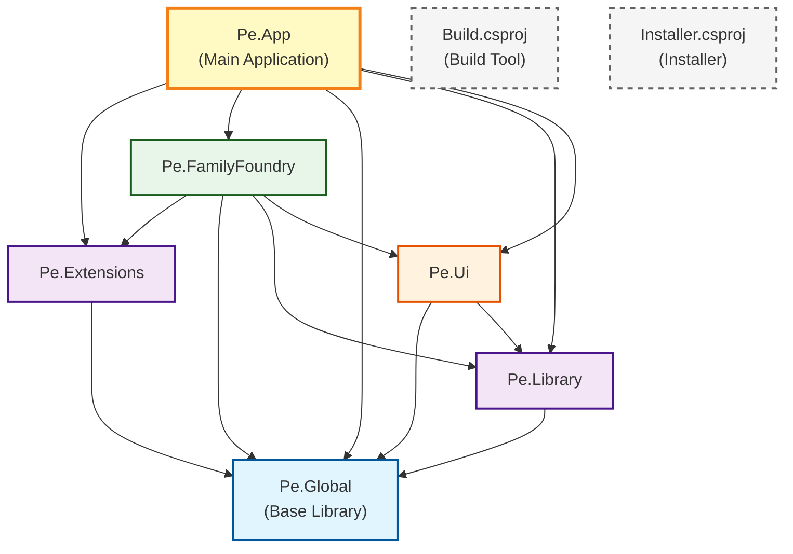

# Project Dependencies Diagram

## Dependency Summary

### Base Layer (No Dependencies)

- **Pe.Global** - Foundation library with no project dependencies

### Second Layer (Depends on Global)

- **Pe.Extensions** → Pe.Global
- **Pe.Library** → Pe.Global

### Third Layer (Depends on Global/Library)

- **Pe.Ui** → Pe.Global, Pe.Library

### Fourth Layer (Depends on Multiple Projects)

- **Pe.FamilyFoundry** → Pe.Extensions, Pe.Global, Pe.Library, Pe.Ui

### Top Layer (Main Application)

- **Pe.App** → Pe.Extensions, Pe.FamilyFoundry, Pe.Global, Pe.Library, Pe.Ui

### Standalone Projects

- **Build.csproj** - Build automation tool (no project references)
- **Installer.csproj** - Installer generator (no project references)
